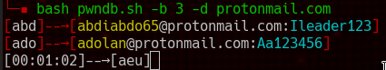

# Pwndb.sh

## An other pwndb tool



this tool was build for solve limitations of pwndb:

- 2000 result max
- 45 sec of max_execution_time
- Only "like results" (for [pwndb.py](https://github.com/davidtavarez/pwndb))
- Reverse password search
- Check if pwndb server is up
- ...


### Searching on "scylla.sh" was remove since website is now dead..


## Install:

You can use the script itself or the docker version:

for the script you will need:

- tor (running)
- curl
- bash
- pup (yay -S pup)

then install with:

```sh
git clone git@github.com:mmpx12/pwndb.git
cd pwndb
sudo cp pwndb.sh /usr/bin/pwndb
sudo chmod +x /usr/bin/pwndb
```


### Termux

For termux run:

```sh
apt update && apt install -y tor pup curl
curl -sk "https://raw.githubusercontent.com/mmpx12/pwndb/master/pwndb.sh" > /data/data/com.termux/files/usr/bin/pwndb
chmod +x /data/data/com.termux/files/usr/bin/pwndb
```

If tor is not running it will start it automaticly and kill it when finish

### Docker

Run with docker (you should pass --net=host if tor is listening on 127.0.0.1 (by default))

You can build the image with:

```sh
docker build . -t pwndb
```

or

```sh
docker pull mmpx12/pwndb
```

#### docker usage:

```sh
docker run --rm --net host -v `pwd`:/app pwndb -p fuckthepolice
docker run --rm --net host -v `pwd`:/app pwndb -U user.lst -D domains.lst -j 10 -o result.txt
docker run --rm -v `pwd`:/app pwndb -U user.lst -D domains.lst -j 10 -o result.txt -x 192.168.75.123:9050
```

if tor is listening on 0.0.0.0, 172.17.0.1 or whatever, you can do:

```sh
docker run --rm -v `pwd`:/app pwndb --proxy 192.168.75.222:9050 -p fuckthepopo -o pass.lst
```

## Usage:

```
-u|--user [USER]          user to check
-U|--user-list [FILE]     file containing users (1 per line)
-e|--exact                check exact user
-d|--domain [DOMAIN]      domain
-D|--domain-list [FILE]   file containing domains (1 per line)
-b|--brute-force [NUMBER] brute force   1 will be A to Z ,
                                        2 will be AA to ZZ
-p|--password [PASSWORD]  reverse password search
-P|--password-list [FILE] file containing passwords
-j|--jobs [number]        number of background jobs (max 10, 5 by default)
-o|--output [file]        output file
-x|--proxy [IP:PORT]      proxy and port of TOR
-s|--server-status        check if pwndb server is up and exit
```

whildecard character is %


#### check if pwndb is up 

Since pwndb is regulary down you can check it with:

```sh
pwndb -s
```

It will exit in both case (up or down)


#### users


you can use:

- "-u|--user" with the user you want to test
- "-U|--user-list" a file containing all the user you want to test
- "-e|--exact" check for this users exactly

for resultat like "gmail.com" (limit to 2000 results),
or query that will take more than 45 seconde (exemple `-d "%.gouv.fr`)you can use `-b 5`, it will brute force from "aaaaa" to "zzzzz" .. it will be slow but works (specialy for query like "%.domain" (1 day and 20h for "%.gouv.fr"))


#### domains


you can use:

- "-d|--domain" with the domain you want to test
- "-D|--domain-list" a file containing all the user you want to test


#### Reverse password search

you search emails that have specific password with

- "-p|--password" with the password you want to check
- "-P|--password-list" a file containing all the password you want to check


#### Background jobs


this will act like false "thread" (background jobs, not real thread).

You can use `-j|--jobs` for set the number of jobs.

You cant set more than 10 background jobs (with more )
 


## exemples:

```
pwndb -u crime -e -d gmail.com -o result.txt
pwndb -u fuck
pwndb -U user.lst -D domain.lst -x 127.0.0.1:9999
pwndb -b 2  -d gmail.com -o result.txt
pwndb -b 4 -j 10 -d "%.gouv.fr"
pwndb -p fuckthepolice -j 10 -x 192.168.75.222:9050
```

